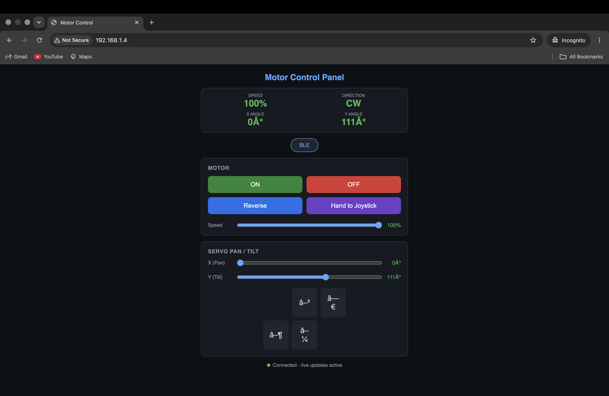
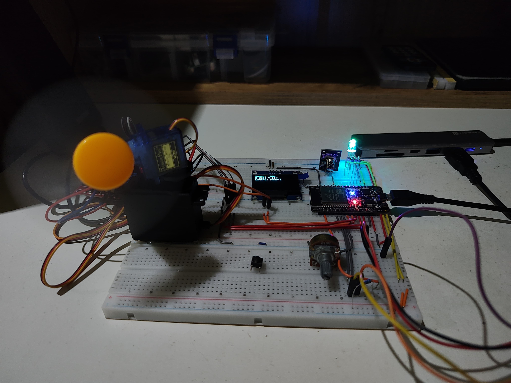
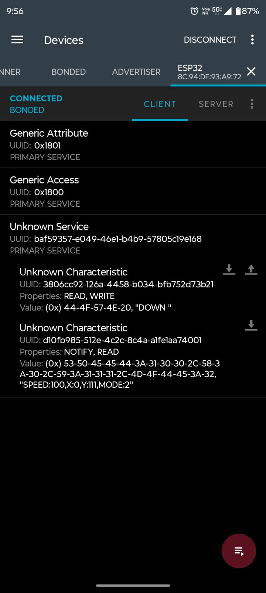
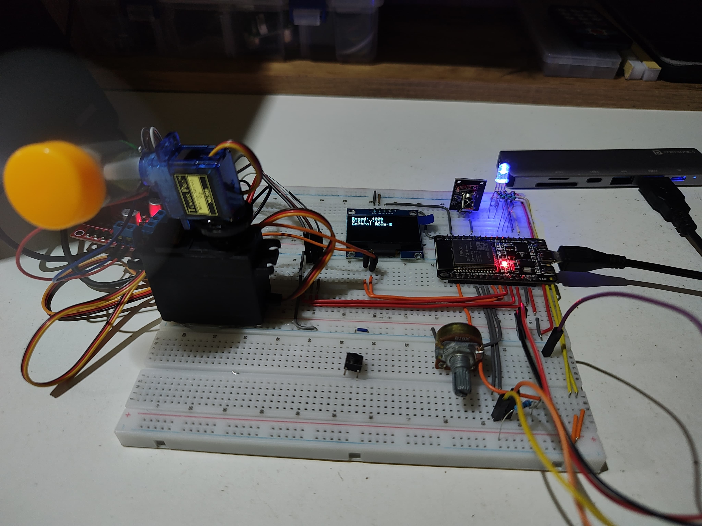
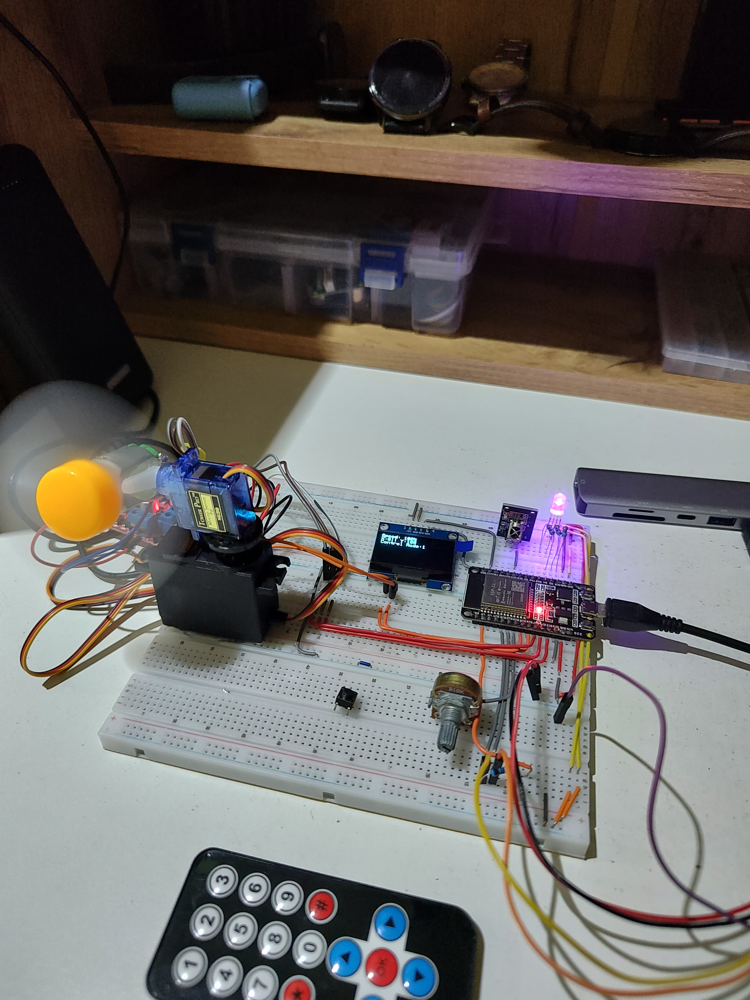
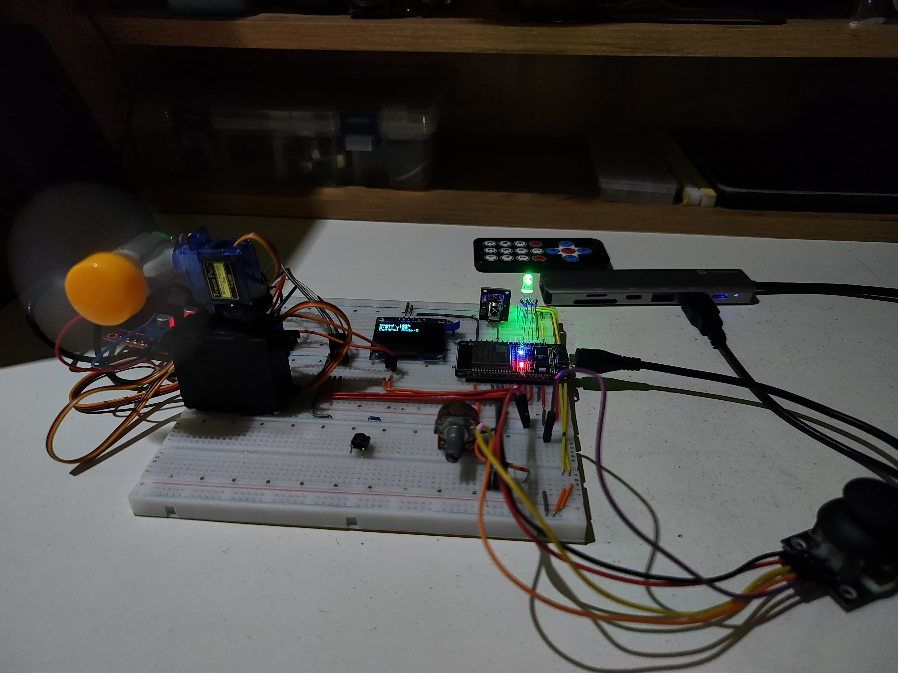

# ESP32 Smart Fan

An ESP32-based smart fan controller with multiple control interfaces. The fan can be controlled using a physical joystick, IR remote, Bluetooth Low Energy (BLE), or a Wi-Fi web dashboard.

The system provides variable motor speed, motor direction control, and two-axis pan/tilt control using servo motors. An OLED display and RGB LED indicators provide real-time feedback about the current operating mode and system state.

## Features

* 🎮 Joystick control
* 📺 IR remote control
* 📱 Bluetooth Low Energy (BLE) control
* 🌐 Wi-Fi web control panel
* ⚙️ Variable motor speed
* 🔄 Motor direction control
* ↔️ X-axis pan control
* ↕️ Y-axis tilt control
* 🖥️ OLED status display
* 💡 LED-based control-mode indication
* ⚡ FreeRTOS tasks for concurrent system operation
* 📡 Real-time WebSocket updates through the Wi-Fi interface

## Control Modes

### 1. Joystick Mode

The physical joystick provides direct control over the fan.

* Joystick X-axis → Pan
* Joystick Y-axis → Tilt
* Joystick potentiometer → Motor speed
* Joystick button → Motor direction

### 2. IR Remote Mode

An IR remote can be used to control the fan without a physical connection.

The remote provides:

* Speed selection
* Motor ON/OFF
* Direction reversal
* Pan left/right
* Tilt up/down

### 3. BLE Mode

The ESP32 operates as a BLE server and accepts commands from a BLE client.

Supported commands include:

```text
ON
OFF
SPEED:<percentage>
LEFT
RIGHT
UP
DOWN
REVERSE
```

The ESP32 also sends status updates containing:

```text
SPEED
X angle
Y angle
Control mode
```

The BLE service uses custom UUIDs for the command and status characteristics.

### 4. Wi-Fi Mode

The ESP32 hosts a web-based motor control dashboard.

The interface provides:

* Motor ON/OFF
* Motor direction reversal
* Speed control
* Pan angle control
* Tilt angle control
* Joystick handover
* Live system status
* Current control mode

The dashboard communicates with the ESP32 using WebSockets, allowing the displayed values to update in real time.

## Hardware

* ESP32 development board
* DC motor / fan
* Motor driver
* 2 × servo motors
* Analog joystick
* IR receiver
* IR remote
* OLED display
* RGB LED
* Push buttons
* Potentiometer / joystick controls
* Breadboard and jumper wires
* External power supply

## Pin Configuration

| Component         | ESP32 Pin |
| ----------------- | --------: |
| Motor PWM         |   GPIO 27 |
| Motor Direction 1 |   GPIO 14 |
| Motor Direction 2 |   GPIO 12 |
| X-axis Servo      |   GPIO 26 |
| Y-axis Servo      |   GPIO 25 |
| OLED SDA/SCL      |       I²C |
| IR Receiver       |   GPIO 19 |
| Joystick X        |   GPIO 35 |
| Joystick Y        |   GPIO 32 |
| Joystick Speed    |   GPIO 33 |
| Joystick Button   |   GPIO 13 |
| Stop Button       |   GPIO 36 |
| Mode LED 1        |   GPIO 15 |
| Mode LED 2        |    GPIO 2 |
| Mode LED 3        |    GPIO 4 |

## OLED Display

The OLED displays the current system state, including:

* Motor speed
* X-axis angle
* Y-axis angle
* Current control mode

Example:

```text
Speed: 100%
X:0 || Y:111
Control Mode: 2
```

## Software

The project is written for the ESP32 using the Arduino framework.

### Libraries

The following libraries are used:

* `Wire`
* `WiFi`
* `BLEUtils`
* `BLEServer`
* `BLEDevice`
* `WebServer`
* `WebSocketsServer`
* `IRremote`
* `ESP32Servo`
* `Adafruit_GFX`
* `Adafruit_SH110X`

Install the required libraries through the Arduino IDE Library Manager where necessary.

## System Architecture

The ESP32 uses FreeRTOS tasks to handle different parts of the system concurrently.

The main tasks include:

```text
Motor Task
Servo Task
Joystick Task
LED Task
Display Task
Wi-Fi Task
```

This allows the motor, servos, display, user interfaces, and networking functions to operate independently.

## Wi-Fi Setup

Before uploading the code, configure your Wi-Fi credentials:

```cpp
const char* SSID = "YOUR_WIFI_SSID";
const char* password = "YOUR_WIFI_PASSWORD";
```

After connecting to the network, the ESP32 prints its local IP address to the Serial Monitor.

Open that IP address in a browser on the same network to access the control dashboard.

Example:

```text
http://192.168.x.x
```

**Do not commit real Wi-Fi credentials to a public repository.**

## BLE Setup

The ESP32 advertises itself as:

```text
ESP32
```

A BLE client such as nRF Connect can be used to connect to the ESP32 and send commands through the custom BLE characteristic.

The device also provides live status notifications.

## Images

### Wi-Fi Control Interface



### Wi-Fi Mode



### BLE Interface



### BLE Mode



### IR Remote Mode



### Joystick Mode



## Demo

A demonstration video of the joystick-controlled system is included in the `demo` folder.

## Project Structure

```text
ESP32-smart-fan/
│
├── README.md
│
├── smart_fan/
│   └── smart_fan.ino
│
├── images/
│   ├── BLE_interface.jpeg
│   ├── BLE_mode.jpeg
│   ├── IRremote_mode.jpeg
│   ├── joystick_mode.jpeg
│   ├── WiFi_interface.png
│   └── WiFi_mode.jpeg
│
└── demo/
    └── Joystick_control.mp4
```

## Future Improvements

* Add automatic temperature-based fan control
* Add a mobile application
* Improve motor speed feedback
* Add persistent settings
* Add authentication to the Wi-Fi control panel
* Improve power management
* Add a physical enclosure
* Add automatic oscillation modes
* Add more advanced fan control algorithms
